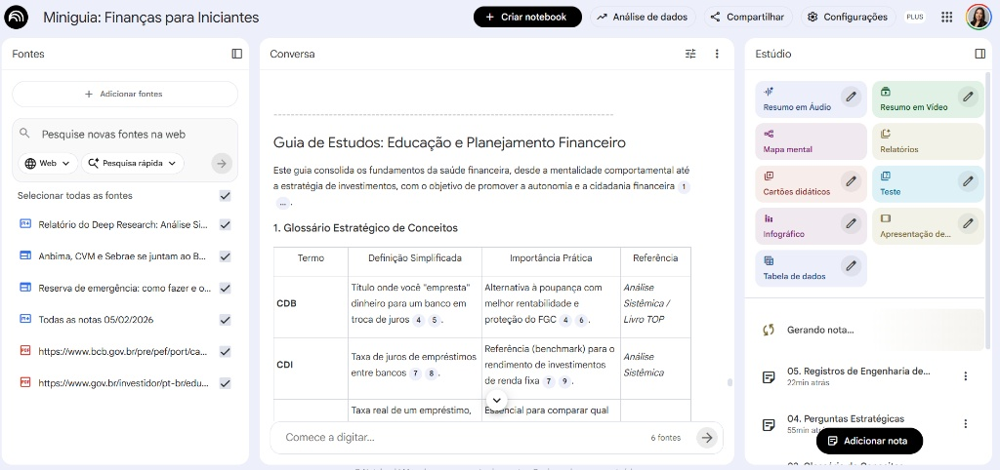
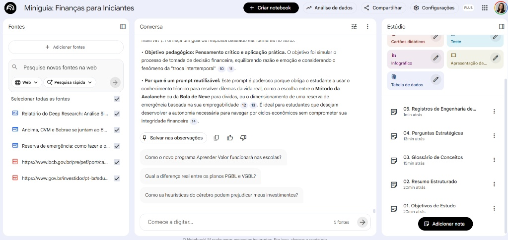

# 📚 Miniguia: Educação Financeira para Iniciantes 
*Projeto desenvolvido para o Bootcamp Bradesco - GenAI e Dados (DIO)*

Este repositório contém o resultado do desafio prático de curadoria e organização de conhecimento utilizando o **Google NotebookLM**. O objetivo foi transformar fontes densas em um guia de estudos acessível e prático.

---

## 📸 Metodologia e Evidências

Para este trabalho, utilizei o NotebookLM não apenas como um chat, mas como um **Estúdio de Aprendizagem**. 
Abaixo, descrevo o que os registros do processo representam:
Para comprovar a metodologia utilizada, apresento os registros da interface de trabalho:
Abaixo, apresento os registros do processo de desenvolvimento, comprovando a organização técnica e o uso de fontes oficiais:

### 1. Curadoria e Estruturação
Conectei fontes de alta credibilidade, como o **Banco Central do Brasil (BCB)** e a **CVM**, organizando o conhecimento em 5 notas lógicas no Estúdio do NotebookLM.

*Figura 1: IA consolidando conceitos como SELIC, CDI e Reserva de Emergência. *

### 2. Geração de Glossário Estratégico
Utilizei engenharia de prompts para converter termos técnicos em uma tabela didática e acessível.

*Figura 2: Notas estruturadas (01 a 05) e fontes oficiais conectadas.*

---

### 1. Curadoria de Fontes Oficiais
Conectei fontes de alta credibilidade para garantir que as informações fossem precisas:
* **Banco Central do Brasil (BCB):** Cadernos de educação financeira.
* **CVM:** Guia de planejamento para investidores.
* **Análise Sistêmica:** Referências técnicas de mercado.

### 2. Estruturação do Conhecimento (Notas 01 a 05)
Conforme demonstrado nos registros da interface, o conhecimento foi organizado em 5 etapas lógicas:
1. **Objetivos de Estudo:** Definição do que o aluno deve aprender.
2. **Resumo Estruturado:** Os pilares da saúde financeira (Receita, Despesa, Reserva).
3. **Glossário Estratégico:** Tradução de termos técnicos para linguagem simples.
4. **Perguntas Estratégicas:** Testes de aplicação prática dos conceitos.
5. **Registro de Prompts:** Documentação da engenharia utilizada para guiar a IA.

> **Nota:** Os prints no projeto comprovam a organização das notas no Estúdio e a rastreabilidade das informações citadas.

---

## 📖 Conteúdo do Miniguia

### 🔹 Glossário de Conceitos Chave
* **CDB** Título onde você empresta dinheiro ao banco. | Melhor que a poupança e protegido pelo FGC. | Análise Sistêmica |
* **CDI** Taxa de juros entre bancos. | Referência para rendimento de renda fixa. | Análise Sistêmica |
* **CET** Taxa real total de um empréstimo. | Essencial para comparar o custo real do crédito. | Caderno BCB |
* **INFLAÇÃO**  Aumento de preços e perda do poder de compra. | Exige busca por ganho acima dela (Ganho Real). | Análise Sistêmica |
* **SELIC**  Taxa básica de juros da economia. | Influencia rendimentos e o custo do crédito. | Caderno BCB |
* **LIQUIDEZ**  Rapidez em converter ativo em dinheiro. | Crucial para a disponibilidade na emergência. | InfoMoney |
* **METODOLOGIA 50/30/20**  Divisão da renda: 50% necessidades, 30% desejos, 20% metas. | Fornece equilíbrio entre consumo presente e segurança futura. | Análise Sistêmica |
* **RESERVA DE EMERGÊNCIA** | Fundo para imprevistos, equivalente a 6 a 12 meses de despesas. | Alicerce da estabilidade; evita o endividamento em crises. | InfoMoney / Análise Sistêmica |
* **SELIC** Taxa básica de juros da economia brasileira. | Influencia o rendimento do Tesouro Selic e o custo do crédito no país. | Caderno BCB |
* **SUITABILITY** Análise do perfil de risco e objetivos do investidor. | Garante que o investimento seja compatível com a tolerância emocional. | Livro TOP CVM |

---

###  Objetivos de Aprendizado
* **DIMENSÃO COMPORTAMENTAL:** Diferenciar sonhos de projetos reais.
* **ESTRUTURAÇÃO ORÇAMENTÁRIA:** Aplicar as etapas de registro e avaliação.
* **ALICERCE DE SEGURANÇA:** Priorizar a reserva antes de ativos de risco.

---

### 🔹 Pilares da Saúde Financeira
O guia foca na **Regra de Ouro** (Gastar menos do que ganha) e na estratégia de **Pague-se Primeiro**, priorizando o investimento logo após o recebimento da renda.
### A. Mentalidade e Comportamento
A saúde financeira exige equilíbrio entre razão e emoção. O conceito de **troca intertemporal** é central: decidir entre consumir hoje ou poupar para consumir mais amanhã.

### B. Organização do Orçamento
* **Regra de Ouro:** O orçamento deve ser superavitário (Receitas > Despesas).
* **Pague-se Primeiro:** Separe a parcela de investimentos (20%) logo após o recebimento.
* **Classificação de Gastos:** Elimine desperdícios e otimize os necessários.

### C. Reserva de Emergência
* **Quanto:** 6 meses de custo de vida (CLT) ou 12 meses (Autônomos).
* **Onde:** Tesouro Selic ou CDBs com liquidez diária (mínimo 100% do CDI).

---

##  Desafios Práticos (Perguntas Estratégicas)

1. **Dívida vs. Reserva:** Mariana possui dívida no cartão e recebeu um bônus. O que fazer?
   - *Resposta:* Priorizar a quitação da dívida. Os juros da dívida crescem mais rápido que qualquer investimento.
---

## 🛠️ Engenharia de Prompts
Utilizei técnicas de **Persona** e **Saída Estruturada** para garantir que a IA entregasse o conteúdo em formatos reutilizáveis. 

**Exemplo de Prompt Utilizado:**
> "Atue como um especialista em educação financeira. Com base nas fontes fornecidas, identifique os principais conceitos técnicos e estruture-os em uma tabela contendo: Termo, Definição Simplificada e Importância Prática."

---
*Este projeto demonstra a união entre Curadoria Humana, Fontes Oficiais e Inteligência Artificial para a criação de conhecimento organizado.*
